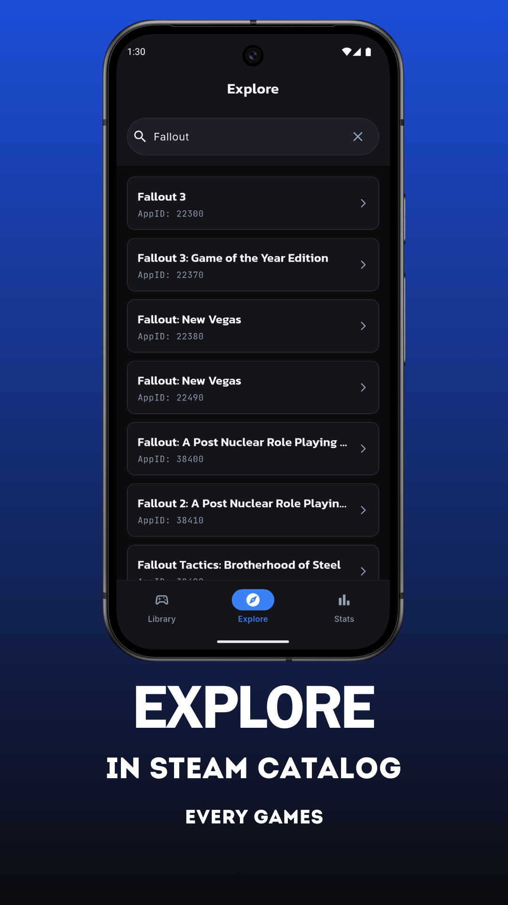
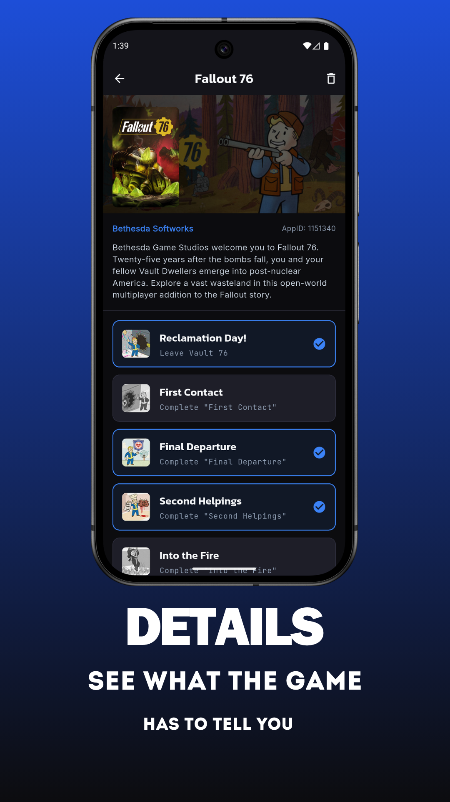
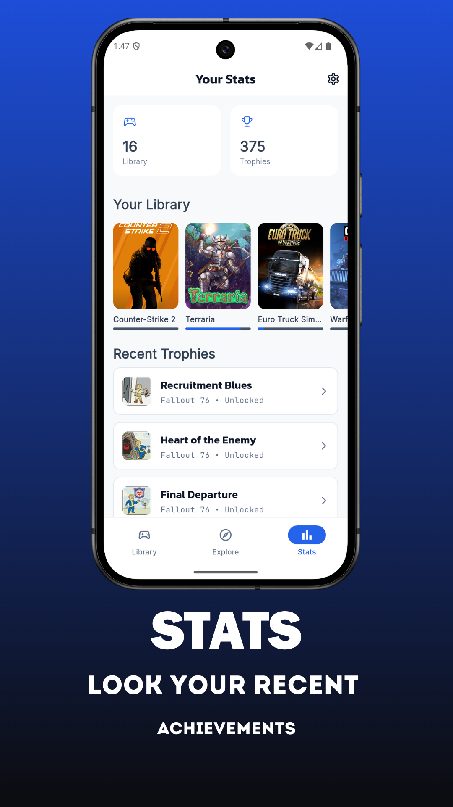
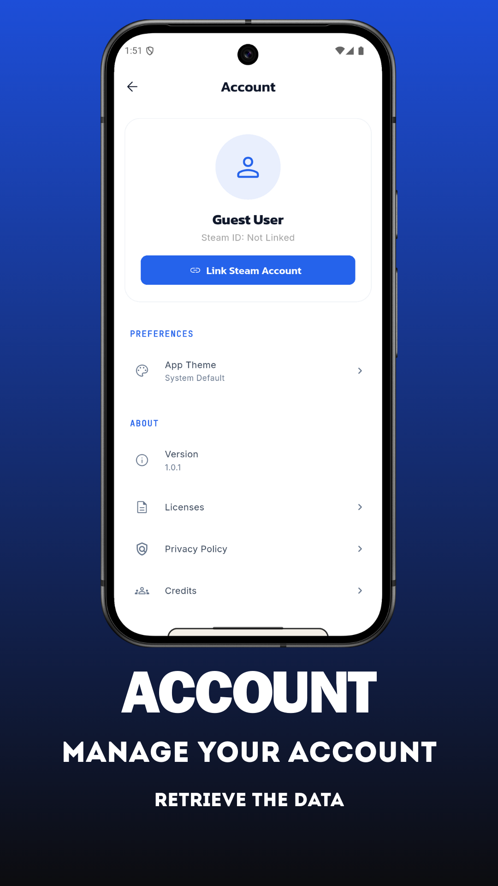

samples, guidance on mobile development, and a full API reference.

# Trophies Tracker

Trophies Tracker is a Flutter app that helps you keep track of your game trophies and achievements across multiple platforms. Easily sync your favorite accounts, explore your game library, and monitor your progress in a modern, intuitive interface.

## Features

## Used Libraries

This project uses the following main libraries:

- flutter_bloc
- go_router
- drift
- path_provider
- get_it
- http
- shared_preferences
- logger
- google_fonts
- flutter_secure_storage
- freezed_annotation
- equatable
- app_links
- url_launcher
- material_symbols_icons
- rxdart
- collection
- cached_network_image
- json_annotation
- path
- sqlite3_flutter_libs
- flutter_launcher_icons
- flutter_native_splash

For development and code generation:

- drift_dev
- build_runner
- freezed
- json_serializable
- flutter_lints

- Multi-platform trophies and achievements tracking
- Sync your accounts and game libraries
- View detailed stats and progress for each game
- Modern, responsive UI
- Secure storage for your credentials
- Support for deep links and sharing

## App Icon

	

## Screenshots

	
	
	
	
	

## Support

If you like this project, consider supporting me!

	

## Getting Started

To run this project:

1. Clone the repository
2. Run `flutter pub get`
3. Run `flutter run`

For more information, see the [Flutter documentation](https://docs.flutter.dev/).
